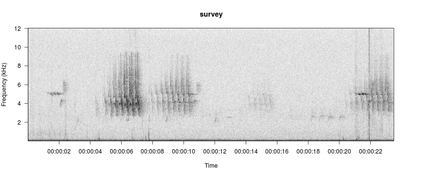

  

# Annotating Spectrograms
Annotation is the process of manually identifying sounds of interest within an audio clip and labeling them. Annotation is possible within `viewSpec()` by setting the arguments `interactive=TRUE` and `annotate=TRUE`.

## viewSpec
```{r, echo=FALSE, comment=NA}
opts_knit$set(self.contained = FALSE)
library(monitoR)
args(viewSpec)
```
As with the default of `annotate=FALSE` you set `interactive=TRUE` to allow paging, zooming, annotation, and other interactive actions. The annotation argument adds an 'a' option to the list on the console.  
With `annotate=TRUE` the spectrogram viewer essentially splits into two modes. In 'browse' mode the navigation options are presented in the console to zoom and page the spectrogram. In 'annotate' mode sounds of interest are repeatedly selected and named. To start annotate mode type an a in the console and press Enter. The function will stay in annotate mode until you actively exit by right-clicking twice in the graphics window.  

```{r fig.height=5, fig.width=12, eval=FALSE}
# use the interactive and annotate option
annos <- viewSpec(survey, interactive=TRUE, annotate=TRUE)
```


```
Starting a new annotation file.
Reading file...
Enter: 
  a to annotate, 
  d to delete annotations, 
  n(m) for next page, 
  b(v) for previous page, 
  p to play, 
  z to zoom in, 
  x to zoom out, 
  s to save page as wave file, 
  c to change spectrogram parameters, 
  q to exit
```

The workflow is as follows:  
  1.  Page through a spectrogam looking for songs of interest and playing audio as necessary.  
  2.  When one or more songs of interest are in the graphics window, type a in the console to enter annotate mode.  
  3.  Select the first song by clicking once each in the upper-left and lower-right. A rectangle will appear around your selection, and in the console you will be prompted to assign a name to the event and press Enter.  
  4.  Repeat for other sounds of interest in the graphics window. Rather than repeatedly typing the same label in the console, you may press Enter to apply the most recently used label.  
  5.  Right-click twice in the graphics device to exit annotate mode and return to browse mode.  
  6.  To end your session, type q in the console and press Enter. You will be prompted to enter a name for your annotation file in the console and press Enter. If you exit the function by pressing Ctrl+C or Esc rather than typing a q in the console your annotations will be saved in a temporary file named TMPannotations.csv in the working directory. They are also returned invisibly.  

To load existing annotations, specify a file path to a csv file with the `anno` argument.

```{r label='loadExistingAnnos', fig.height=5, fig.width=12, comment=NA}
data(survey)
data(survey_anno)
write.csv(survey_anno, 'annos.csv', row.names=FALSE)
viewSpec(survey, annotate=TRUE, anno='annos.csv')
```

Values stored by the annotate mode are placed in a data frame:

```{r}
survey_anno
```

Annotations are valuable for a variety of purposes that includes evaluating your templates, which will be covered elsewhere.

```{r echo=FALSE}
x <- file.remove('annos.csv')
```


