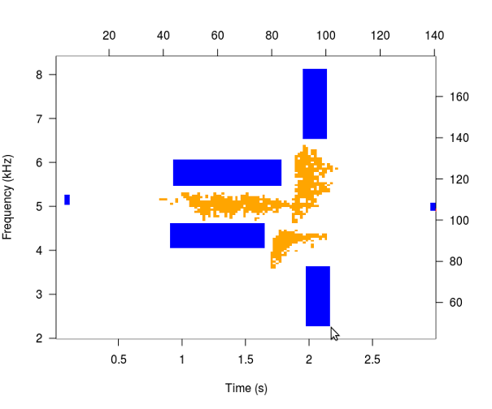
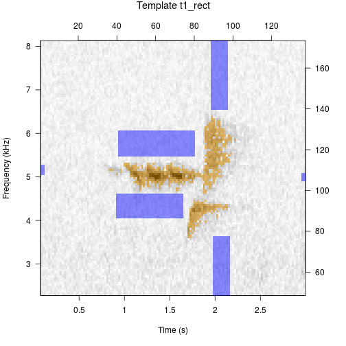
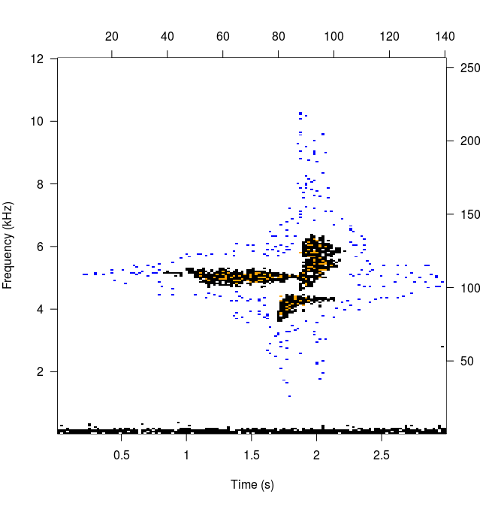
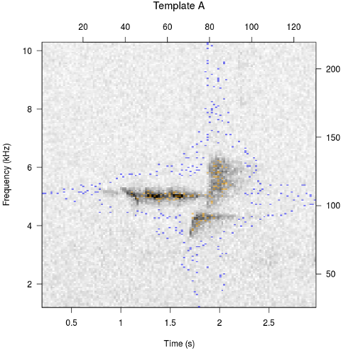

## Making Binary Point Templates
These examples explore the function arguments. You can also <a href="makingBinTemplates.html" target="_blank">read the article.</a>

```{r include=FALSE}
opts_chunk$set(fig.show='hold', warning=FALSE, results='hide')
```

### Get clip, write to file
```{r}
data(btnw)
tuneR::writeWave(btnw, 'btnw.wav')
```

### Change amp.cutoff
```{r example1}
template <- makeBinTemplate('btnw.wav', amp.cutoff = -45)
plot(template)
```
```{r example1_1}
template <- makeBinTemplate('btnw.wav', amp.cutoff = -25)
plot(template)
```

### Automatic point selection 
Automatic is the default because it does not require interactivity and allows the package vignette and examples to build. In general use it is unlikely that users will build the most effective templates with the "auto" option.  


```{r example1_2}
template <- makeBinTemplate('btnw.wav', amp.cutoff=-35)
plot(template)
```

### Change select to 'rectangle'
```{r eval=FALSE}
template <- makeBinTemplate('btnw.wav', select='rectangle', amp.cutoff=-35)
```



### Change select to 'cell'
```{r eval=FALSE}
template <- makeBinTemplate('btnw.wav', select='cell', amp.cutoff=-35)
```



### Change time limits
```{r example2}
template <- makeBinTemplate('btnw.wav', t.lim = c(0.75, 2.25), amp.cutoff = -35)
plot(template)
```

### Change frequency limits
```{r example3}
template <- makeBinTemplate('btnw.wav', frq.lim = c(3, 7), amp.cutoff = -35)
plot(template)
```

### Change buffer
```{r example4}
template <- makeBinTemplate('btnw.wav', buffer = 4, amp.cutoff = -35)
plot(template)
```

### Change selection density
```{r example5}
template <- makeBinTemplate('btnw.wav', dens = 0.4, amp.cutoff = -35)
plot(template)
```

### Change FFT parameters
```{r example6}
template <- makeBinTemplate('btnw.wav', wl = 1024, ovlp = 75, amp.cutoff = -35)
plot(template)
```

### Change template name
```{r example6_1}
template <- makeBinTemplate('btnw.wav', name='btnw_typeB_5kHz', amp.cutoff = -35)
plot(template)
```

### Intersection of two clips
<a href="https://github.com/jonkatz2/monitoR/blob/gh-pages/assets/makingTemplates/btnw2.wav?raw=true">(download the second clip)</a>

```{r}
btnw_2 <- c('btnw.wav', 'btnw2.wav')
```
```{r example7}
viewSpec(btnw_2[1]) # The clip that comes with the package
viewSpec(btnw_2[2]) # Another song, ~800Hz higher frequency
```
```{r eval=FALSE}
template <- makeBinTemplate(btnw_2, t.lim = list(c(0.75, 2.25),c(1.5, 3.5)), frq.lim = c(3, 8), amp.cutoff = -35)
```

```
## Interactive clip alignment.
## Enter l, ll, ll, etc. for left shift, 
## r, rr, rrr, etc. for right shift, 
## or Enter to continue.
```

```
ll
lll
l
```


```{r include=FALSE}
template <- readBinTemplates('intersect.bt')
```
```{r example8}
plot(template)
```

### Combine templates
```{r example9, fig.show='hide'}
template1 <- makeBinTemplate('btnw.wav', name='btnw_typeB_5kHz', amp.cutoff = -35)
template2 <- makeBinTemplate('btnw2.wav', name='btnw_typeB_5.8kHz', amp.cutoff = -35)
```
```{r example9_1}
templates <- combineBinTemplates(template1, template2)
plot(templates, ask=FALSE)
```


