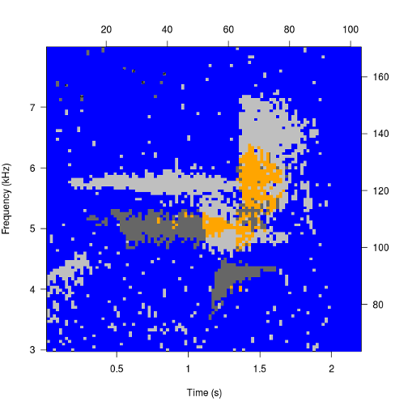

---
layout: default
title : Annotating Spectrograms
group: navigation
---  


## Making Binary Point Templates
### Get clip, write to file

```r
data(btnw)
tuneR::writeWave(btnw, 'btnw.wav')
```

### Change amp.cutoff

```r
template <- makeBinTemplate('btnw.wav', amp.cutoff = -45)
```


```
## 
## Automatic point selection.
## 
## Done.
```

```r
plot(template)
```


```r
template <- makeBinTemplate('btnw.wav', amp.cutoff = -25)
```


```
## 
## Automatic point selection.
## 
## Done.
```

```r
plot(template)
```


### Change time limits

```r
template <- makeBinTemplate('btnw.wav', t.lim = c(0.75, 2.25), amp.cutoff = -35)
```


```
## 
## Automatic point selection.
## 
## Done.
```

```r
plot(template)
```


### Change frq limits

```r
template <- makeBinTemplate('btnw.wav', frq.lim = c(3, 7), amp.cutoff = -35)
```


```
## 
## Automatic point selection.
## 
## Done.
```

```r
plot(template)
```


### Change buffer

```r
template <- makeBinTemplate('btnw.wav', buffer=4, amp.cutoff = -35)
```


```
## 
## Automatic point selection.
## 
## Done.
```

```r
plot(template)
```


### Change density

```r
template <- makeBinTemplate('btnw.wav', dens=0.4, amp.cutoff = -35)
```


```
## 
## Automatic point selection.
## 
## Done.
```

```r
plot(template)
```


### Change FFT params

```r
template <- makeBinTemplate('btnw.wav', wl = 1024, ovlp = 75, amp.cutoff = -35)
```


```
## 
## Automatic point selection.
## 
## Done.
```

```r
plot(template)
```


### Intersection of two clips
<a href="assets/makingBinTemplates/btnw2.wav">(download the second clip)</a>

```r
btnw_2 <- c('btnw.wav', 'btnw2.wav')
```

```r
viewSpec(btnw_2[1])
```


```r
viewSpec(btnw_2[2])
```


```r
template <- makeBinTemplate(btnw_2, t.lim = list(c(0.75, 2.25),c(1.5, 3.5)), frq.lim = c(3, 8), amp.cutoff = -35)
```
```
## Interactive clip alignment.
## Enter l, ll, ll, etc. for left shift, 
## r, rr, rrr, etc. for right shift, 
## or Enter to continue.
```

```
ll
lll
l
```





```r
template <- readBinTemplates('intersect.bt')
```

```r
plot(template)
```

```
## Warning in min(x): no non-missing arguments to min; returning Inf
```

```
## Warning in max(x): no non-missing arguments to max; returning -Inf
```


