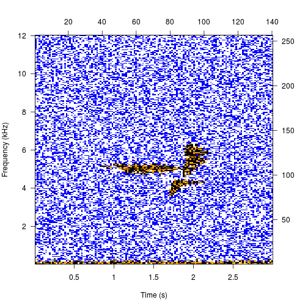
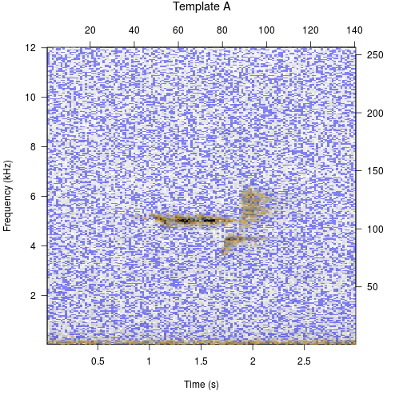

---
layout: default
title : binTemplate examples
group: navigation
---  

## Making Binary Point Templates
These examples explore arguments beyond `select`. To see examples with `select` <a href="makingBinTemplates.html" target="_blank">read the longer article.</a>


### Get clip, write to file

```r
data(btnw)
tuneR::writeWave(btnw, 'btnw.wav')
```

### Change amp.cutoff

```r
template <- makeBinTemplate('btnw.wav', amp.cutoff = -45)
```

```r
plot(template)
```


```r
template <- makeBinTemplate('btnw.wav', amp.cutoff = -25)
```

```r
plot(template)
```


### Change time limits

```r
template <- makeBinTemplate('btnw.wav', t.lim = c(0.75, 2.25), amp.cutoff = -35)
```


```r
plot(template)
```


### Change frequency limits

```r
template <- makeBinTemplate('btnw.wav', frq.lim = c(3, 7), amp.cutoff = -35)
```


```r
plot(template)
```


### Change buffer

```r
template <- makeBinTemplate('btnw.wav', buffer = 4, amp.cutoff = -35)
```


```r
plot(template)
```


### Change seelction density

```r
template <- makeBinTemplate('btnw.wav', dens = 0.4, amp.cutoff = -35)
```


```r
plot(template)
```



### Change FFT parameters

```r
template <- makeBinTemplate('btnw.wav', wl = 1024, ovlp = 75, amp.cutoff = -35)
```


```r
plot(template)
```


### Intersection of two clips
<a href="https://github.com/jonkatz2/monitoR/blob/gh-pages/assets/makingTemplates/btnw2.wav?raw=true">(download the second clip)</a>


```r
btnw_2 <- c('btnw.wav', 'btnw2.wav')
```

```r
viewSpec(btnw_2[1]) # The clip that comes with the package
viewSpec(btnw_2[2]) # Another song, ~800Hz higher frequency
```


```r
template <- makeBinTemplate(btnw_2, t.lim = list(c(0.75, 2.25),c(1.5, 3.5)), frq.lim = c(3, 8), amp.cutoff = -35)
```

```
## Interactive clip alignment.
## Enter l, ll, ll, etc. for left shift, 
## r, rr, rrr, etc. for right shift, 
## or Enter to continue.
```

```
ll
lll
l
```


```r
plot(template)
```


