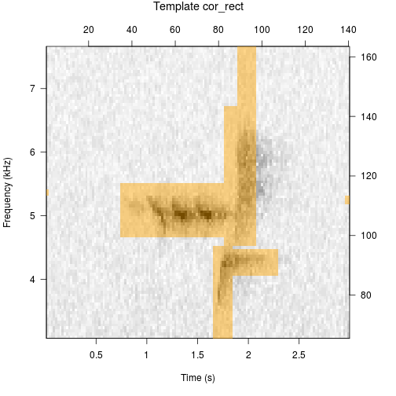
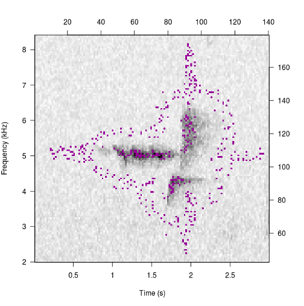

## Making Spectrogram Cross-correlation Templates
These examples explore arguments beyond `select`. To see examples with `select` <a href="makingCorTemplates.html" target="_blank">read the longer article.</a>

```{r include=FALSE}
opts_chunk$set(fig.show='hold', warning=FALSE, results='hide')
```

### Get clip, write to file
```{r}
data(btnw)
tuneR::writeWave(btnw, 'btnw.wav')
```

### Automatic point selection 
Automatic is the default because it does not require interactivity and allows the package vignette and examples to build. In general use it is unlikely that users will build the most effective templates with the "auto" option.  


```{r example1_2}
template <- makeCorTemplate('btnw.wav')
plot(template)
```

### Change select to 'rectangle'
```{r eval=FALSE}
template <- makeCorTemplate('btnw.wav', select='rectangle')
```



### Change select to 'cell'
```{r eval=FALSE}
template <- makeCorTemplate('btnw.wav', select='cell')
```



### Change time limits
```{r corExample2}
template <- makeCorTemplate('btnw.wav', t.lim = c(0.75, 2.25))
plot(template)
```

### Change frequency limits
```{r corExample3}
template <- makeCorTemplate('btnw.wav', frq.lim = c(3, 7))
plot(template)
```

### Change selection density
```{r corExample5}
template <- makeCorTemplate('btnw.wav', dens = 0.4)
plot(template)
```

### Change FFT parameters
```{r corExample6}
template <- makeCorTemplate('btnw.wav', wl = 1024, ovlp = 75)
plot(template)
```

### Change template name
```{r corExample6_1}
template <- makeCorTemplate('btnw.wav', name='btnw_typeB_5kHz')
plot(template)
```

### Combine templates
```{r corExample9, fig.show='hide'}
template1 <- makeCorTemplate('btnw.wav', name='btnw_typeB_5kHz')
template2 <- makeCorTemplate('btnw2.wav', name='btnw_typeB_5.8kHz')
```
```{r corExample9_1}
templates <- combineCorTemplates(template1, template2)
plot(templates, ask=FALSE)
```


