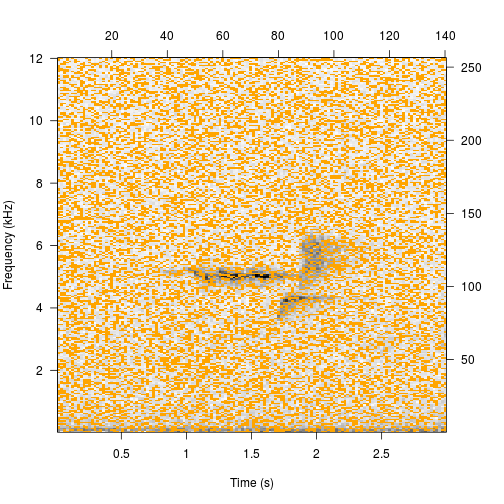

---
layout: default
title : corTemplate examples
group: navigation
---  


## Making Spectrogram Cross-correlation Templates
These examples explore arguments beyond `select`. To see examples with `select` <a href="makingCorTemplates.html" target="_blank">read the longer article.</a>


### Get clip, write to file

```r
data(btnw)
tuneR::writeWave(btnw, 'btnw.wav')
```

### Change time limits

```r
template <- makeCorTemplate('btnw.wav', t.lim = c(0.75, 2.25))
plot(template)
```


### Change frequency limits

```r
template <- makeCorTemplate('btnw.wav', frq.lim = c(3, 7))
plot(template)
```


### Change buffer

```r
template <- makeCorTemplate('btnw.wav', buffer = 4)
```

```
## Error in spectro(wave = clip, wl = wl, ovlp = ovlp, wn = wn, ...): unused argument (buffer = 4)
```

```r
plot(template)
```


### Change selection density

```r
template <- makeCorTemplate('btnw.wav', dens = 0.4)
plot(template)
```



### Change FFT parameters

```r
template <- makeCorTemplate('btnw.wav', wl = 1024, ovlp = 75)
plot(template)
```


### Change template name

```r
template <- makeCorTemplate('btnw.wav', name='btnw_typeB_5kHz')
plot(template)
```


### Combine templates

```r
template1 <- makeCorTemplate('btnw.wav', name='btnw_typeB_5kHz')
```

```r
template2 <- makeCorTemplate('btnw2.wav', name='btnw_typeB_5.8kHz')
```

```r
templates <- combineCorTemplates(template1, template2)
plot(templates, ask=FALSE)
```


