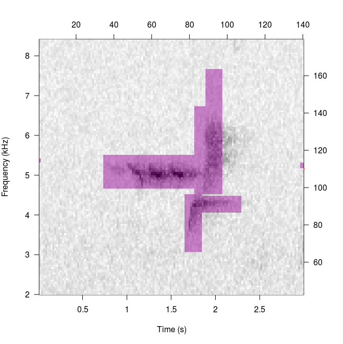
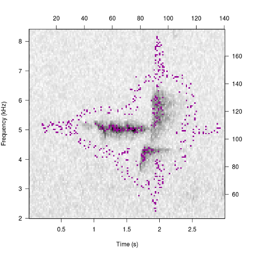

```{r echo=FALSE}
library(monitoR)
```

# Making Templates
Most of the template creation process is covered in the vignette (Quick Start Guide), but we can cover it once more here. Making templates is possibly the single most subjective aspect of automated detection, so users attempting to start a monitoring program will probably spend many hours making and testing templates.  

The first step is to select a sound clip that we will use. A sound clip can be exported from `viewSpec()`, downloaded from a website, or recorded specifically for use as a template. When selecting a template and developing performance expectations it will be useful to understand how the template is used by the scoring functions.  

Templates are evaluated at all time bins in the survey (left-to-right), but they are not evaluated at all frequency bins (up and down). Therefore if the target sound is always emitted within the same frequency band it may be possible to detect it reliably with a single template. On the other hand, if it is a stereotyped sound emitted with the same pattern but within different frequency bands, a template may need to be created for each frequency band.  

A sound clip that will be used for a template must be recorded at the same sampling rate as the surveys.  

For this example we will use the recordings that come with the package. The package contains two template matching functions, but they do not use the same template structure. To some extent they employ the same arguments, so we will pay careful attention to how the binary point matching method differs from the spectrogram cross-correlation method.  

<div class="row">
<div class="col-md-6">
<h3><a href="assets/makingTemplates/makingBinTemplates.html" target="_blank">Binary point matching:</a></h3>
<ol>  
  <li> Three methods of selecting points in a template </li>  
  <li> Template consists of "on" and "off" point locations </li>  
  <li> Scoring is difference between on and off points (signal to noise difference) in the survey </li>  
</ol>
</div>
<div class="col-md-6">
<h3>Spectrogram cross-correlation (this page):</h3>
<ol>  
  <li> Three methods of selecting points in a template </li>  
  <li> Template consists of only "points" and their locations </li>  
  <li> Scoring is based on correlation of amplitude values between the template and the survey </li>
</ol>  
</div>
</div>

First load the black-throated green warbler song included with the package.  
```{r cor1}
library(monitoR)
data(btnw)
viewSpec(btnw)

```

## Spectrogram cross correlation templates
The three methods of selecting points in the template creation process are:  

  *  Automatic (default, "auto")  
  *  Rectangular area selection ("rectangle")  
  *  Individual point selection ("cell")  

### Automatic template creation 
Automatic is the default because it does not require interactivity and allows the package vignette and examples to build. In general use it is unlikely that users will build the most effective templates with the "auto" option.  


```{r cor2}
t1_auto <- makeCorTemplate('btnw.wav', frq.lim=c(2, 8.4), name='t1_auto')
```
Printing the template yields a description of the contents of the template.  

```{r cor3}
t1_auto
```

Plot the template to see how it fits on the original sound clip. To keep templates lightweight the original clip is not stored within the template but as a file path. When the clip is a wave object rather than a file path, the clip is saved to the working directory as long as the argument `write.wav=TRUE` (if `write.wav=FALSE`, the function will yield an error).  

```{r cor4}
plot(t1_auto)
```

### Manual template creation 
The only step in this process is point selection.  

The name that will be displayed in all detection output and some spectrogram parameters is specified in the function call as well.  

```{r eval=FALSE}
cor_rect <- makeCorTemplate('btnw.wav', frq.lim=c(2, 8.4), select='rect', name='cor_rect')
```




#### Point selection

The interactive options require the user to select cells from an image plot of a spectrogram. The "cell" option adds a single point per click and is probably suited for templates with few points. The "rectangle" option collects all points between two clicks, which define the upper-left and lower-right corners or a rectangle.  

In this call we've used `select="rect"`, which is equivalent to `select="rectangle"`.  

Point selection operates as a continuous loop until broken by right clicking twice in the graphics device. Since we have a very clean recording of our call we can simply select all points with one large rectangle (start with the upper left corner, then select the lower right corner), or we can make more subtle selections consisting of multiple rectangles.


The signal component of this clip is only about 1 second long, but I've artificially extended the template duration to about 3 seconds by selecting some tiny points at the edges. I did this because the peak detecting algorithm (in `findPeaks()`) will yield a value for each template duration in the survey. If you are planning to sort through the peaks (e.g. to identify false negatives at a score threshold), this may yield more manageable results since a 1 second long template will yield roughly `r 10*60` peaks in a survey, while a 3 second long template will yield about `r 10*60/3` peaks. The scoring algorithm (in function `binMatch()`) returns only the center time of each score, so I've taken some care to maintain the center of the template in the center of the signal component.  

```{r echo=FALSE}
cor_rect <- readCorTemplates(files='cor_rect.ct')
```
```{r cor5}
t1_rect
plot(cor_rect)
```

After a template has been made, you may wish to:  

  *  Rename the template: use the assignment function `templateNames()<-`  
  *  Change the score cutoff: use the assignment function `templateCutoff()<-`  
  *  Add a comment (e.g. clip source, performance results, etc.): use the assignment function `templateComment()<-`  
  *  Move the clip location: use the assignment function `templatePath()<-`  
  *  Save the template to disk: use the function `writeCorTemplates()`  
  *  Combine it with others for use at the same time: use `combineCorTemplates()`  

#### Selecting with "cell"

```{r eval=FALSE}
cor_cell <- makeCorTemplate('btnw.wav', frq.lim=c(2, 8.4), select='cell', name='cor_cell')
```



```{r echo=FALSE}
cor_cell <- readCorTemplates(files='cor_cell.ct')
```
```{r cor6}
t1_rect
plot(cor_cell)
```


