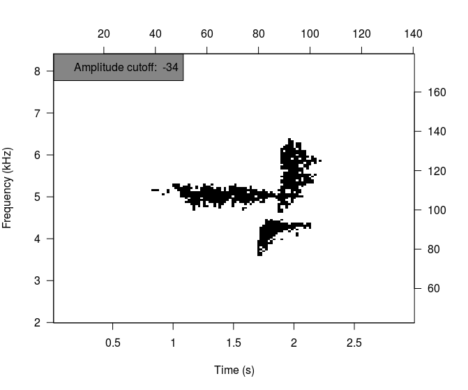
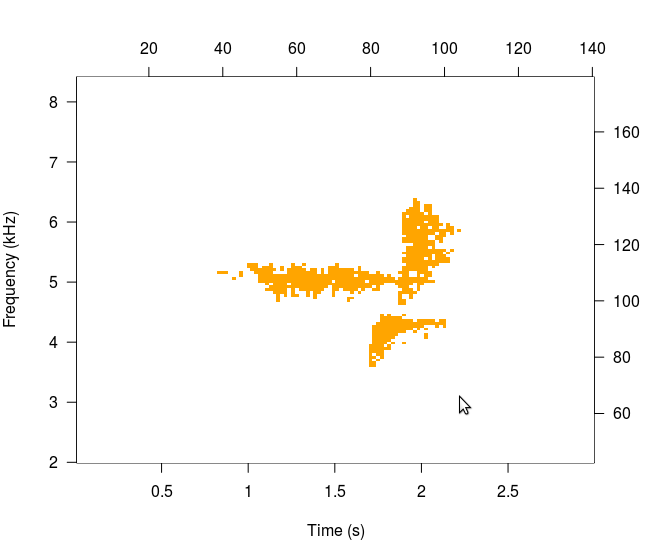

# Making Templates
Most of the template creation process is covered in the vignette (Quick Start Guide), but we can cover it once more here. Making templates is possibly the single most subjective aspect of automated detection, so users attempting to start a monitoring program will probably spend many hours making and testing templates.  

The first step is to select a sound clip that we will use. A sound clip can be exported from `viewSpec()`, downloaded from a website, or recorded specifically for use as a template. When selecting a template and developing performance expectations it will be useful to understand how the template is used by the scoring functions.  

Templates are evaluated at all time bins in the survey (left-to-right), but they are not evaluated at all frequency bins (up and down). Therefore if the target sound is always emitted within the same frequency band it may be possible to detect it reliably with a single template. On the other hand, if it is a stereotyped sound emitted with the same pattern but within different frequency bands, a template may need to be created for each frequency band.  

A sound clip that will be used for a template must be recorded at the same sampling rate as the surveys.  

For this example we will use the recordings that come with the package. The package contains two template matching functions, but they do not use the same template structure. To some extent they employ the same arguments, so we will pay careful attention to how the binary point matching method differs from the spectrogram cross-correlation method.  
<div class="container">
<div class="row">
<div class="col-md-6">
Binary point matching:  
  > Three methods of selecting points in a template  
  > Template consists of "on" and "off" point locations  
  > Scoring is difference between on and off points (signal to noise difference) in the survey  
</div>
<div class="col-md-6">  
Spectrogram cross-correlation:  
  > Three methods of selecting points in a template  
  > Template consists of only "points" and their locations  
  > Scoring is based on correlation of amplitude values between the template and the survey  
</div>
</div>
</div>
First load the black-throated green warbler song included with the package.  

```r
library(monitoR)
data(btnw)
viewSpec(btnw)
```


## Binary point matching templates
The three methods of selecting points in the template creation process are:  
  > Automatic (default, "auto")  
  > Individual point selection ("cell")  
  > Rectangular area selection ("rectangle")  
  
Automatic is the default because it does not require interactivity and allows the package vignette and examples to build. In general use it is unlikely that users will build the most effective templates with the "auto" option.  


```
## [1] TRUE
```

```r
t1_auto <- makeBinTemplate(btnw, frq.lim=c(2, 8.4), amp.cutoff=-34, name='t1_auto', write.wav=TRUE)
```


```
## 
## Automatic point selection.
## 
## Done.
```

```r
t1_auto
```

```
## 
## Object of class "binTemplateList"
## 
## 	containing  1  templates
##         original.recording sample.rate lower.frequency upper.frequency
## t1_auto           btnw.wav       24000        2.015625        8.390625
##         duration on.points off.points score.cutoff
## t1_auto     2.97       708      18472           12
```

```r
plot(t1_auto)
```


The interactive options require the user to select cells from an image plot of a spectrogram. The "cell" option adds a single point per click and is probably suited for templates with few points. The "rectangle" option collects all points between two clicks, which define the upper-left and lower-right corners or a rectangle. Selection between the 


```r
t1_rect <- makeBinTemplate(btnw, frq.lim=c(2, 8.4), select='rect', name='t1_rect', write.wav=TRUE)
```
```
## Interactive amplitude cutoff selection.
## Enter l, ll, ll, etc. for lower cutoff, 
## h, hh, hhh, etc. for higher cutoff, 
## or hit Enter to continue

## Current cutoff: -49
```


```
## Current cutoff: -49
hhh

## Current cutoff: -43
hh

## Current cutoff: -40
hh

## Current cutoff: -37
hh

## Current cutoff: -34
```



```
## Select upper left corner of "on" rectangle with a left click.
## Right click to continue.

## Select lower right corner of "on" rectangle with a left click.

## Select upper left corner of "on" rectangle with a left click.
## Right click to continue.
```


```
## Select upper left corner of "off" rectangle with a left click.
## Right click to continue.

## Select lower right corner of "off" rectangle with a left click.
```


```

## Select upper left corner of "off" rectangle with a left click.
## Right click to continue.

## Select lower right corner of "off" rectangle with a left click.

## Select upper left corner of "off" rectangle with a left click.
## Right click to continue.

## Select lower right corner of "off" rectangle with a left click.

## Select upper left corner of "off" rectangle with a left click.
## Right click to continue.

## Select lower right corner of "off" rectangle with a left click.

## Select upper left corner of "off" rectangle with a left click.
## Right click to continue.

## Select lower right corner of "off" rectangle with a left click.

## Select upper left corner of "off" rectangle with a left click.
## Right click to continue.

## Select lower right corner of "off" rectangle with a left click.

## Select upper left corner of "off" rectangle with a left click.
## Right click to continue.
```


```r
t1_rect
```

```
## 
## Object of class "binTemplateList"
## 
## 	containing  1  templates
##         original.recording sample.rate lower.frequency upper.frequency
## t1_rect           btnw.wav       24000        2.296875        8.109375
##         duration on.points off.points score.cutoff
## t1_rect      2.9       708       1525           12
```

```r
plot(t1_rect)
```


