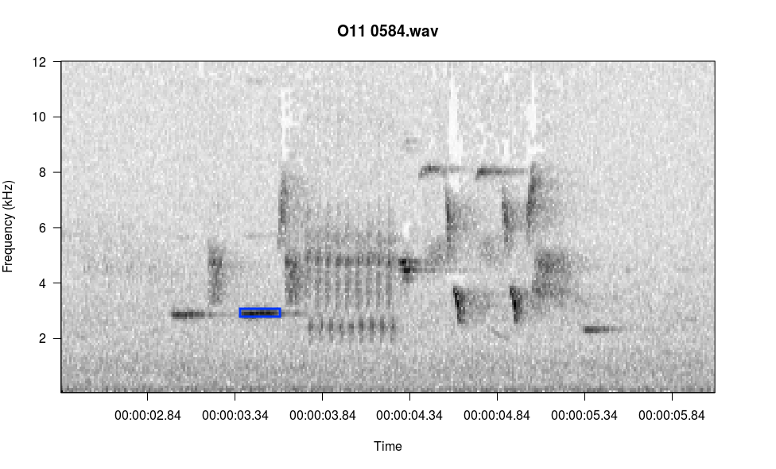

# Viewing Spectrograms
All functions in monitoR accept a consistent group of inputs; for example, all funtions read the same file types and specify axis limits using the same arguments. Hence, the argument names and values offered here as examples to nearly all plotting methods in monitoR. 

## viewSpec
```{r, echo=FALSE, comment=NA}
opts_knit$set(self.contained = FALSE)
library(monitoR)
args(viewSpec)
```
To assist with documentation this function opens a graphics device, plots the first 30-seconds of the spectrogram, and then exits. In normal use you can set `interactive=TRUE` to allow paging, zooming, annotation, and other interactive actions.

+ [File types](#filetypes)
+ [Spectrogram color and contrast](#colorcontrast)
+ [Changing the axes](#changingtheaxes)
+ [Interactivity](#interactivity)
  
<h3 id="filetypes">Acceptable File Types</h3>
The `clip` argument in `viewSpec()` accepts wav objects (from package tuneR) or a file path to a wav or mp3 object.  

```{r fig.height=5, fig.width=12}
data(survey)
viewSpec(survey)
viewSpec("/home/jon/Documents/personalWebsite/monitoR/O11 0584.wav")
```

<h3 id="colorcontrast">Adjusting Spectrogram Color and Contrast</h3>
Color palette is specified with the `spec.col` argument. R has several built-in color palettes, plus functions for creating custom palettes. Similarly, monitoR builds on the built-in gray palettes to offer several easy-to-change contrast options.   

`gray.1()`, `gray.2()`, and `gray.3()` are built-in to monitoR. Here we define a fourth option using the same process as the built-in versions, and we compare how the color palette visually separates the signal and background noise.   

```{r fig.height=10, fig.width=12}
gray.4 <- function(n = 30) gray(1-seq(0, 1, length.out = n)^4)

par(mfrow=c(4,1))
viewSpec(survey, spec.col=gray.1(), main='gray.1()')
viewSpec(survey, spec.col=gray.2(), main='gray.2()')
viewSpec(survey, spec.col=gray.3(), main='gray.3()')
viewSpec(survey, spec.col=gray.4(), main='gray.4()')
```

Amplitudes in each cell of a spectrogram are relative to the other values in the matrix rather than to an absolute reference value, and they typically range from a low of around -60 to a max of around 0. We can illustrate how the different palettes rearrange the grayscale to move the transition from light-to-dark along to different amplitudes.

```{r fig.width=12}
n <- 30
layout(matrix(c(1,2), nrow=1), widths=c(2,8))
par(mar=c(5.1,4.1,4.1,0))
image(x=c(1,2),y=seq(0,1,length.out=n+1), z=t(matrix(seq(0,1,length.out=n), nrow=n)), 
    col=gray.1(), axes=FALSE, xlab=NA, ylab='Gray Value')
box()
par(mar=c(5.1,0,4.1,2.1))
plot(seq(0, -60, length.out=n), 1-seq(0, 1, length.out = n)^4, type='l', 
    xlab='Relative Amplitude', ylab=NA,yaxt='n', lty=5)
lines(seq(0, -60, length.out=n), 1-seq(0, 1, length.out = n)^3, lty=4)
lines(seq(0, -60, length.out=n), 1-seq(0, 1, length.out = n)^2, lty=3)
lines(seq(0, -60, length.out=n), 1-seq(0, 1, length.out = n), lty=1)
legend('bottomright', legend=c('1-x', '1-x^2', '1-x^3', '1-x^4'), lty=c(1,3,4,5), bty='n')
```

And of course you can use more colorful palettes if you prefer.  

```{r fig.height=10, fig.width=12}
par(mfrow=c(4,1))
viewSpec(survey, spec.col=rev(heat.colors(15)), main='rev(heat.colors(15))')
viewSpec(survey, spec.col=rev(topo.colors(15)), main='rev(topo.colors(15))')
viewSpec(survey, spec.col=rev(rainbow(15)), main='rev(rainbow(15))')
viewSpec(survey, spec.col=rev(terrain.colors(8)), main='rev(terrain.colors(8))')
```

The amplitudes are computed for each page of the spectrogram, so it is entirely possible that the min and max on one page are wildly different than the min and max on the next page, and as a result the color gradients int he two images will not represent the same amplitude gradient. For example, if page one contains a distant bird song with a mean amplitude of -30 and a max amplitude of -10, but page 2 contains loud wind noise with a max amplitude of 0, cells with an amplitude of -30 on the second page may appear lighter than cells with that value on the first page. The `consistent=TRUE` argument attempts to minimize this effect by setting the max value of a single cell in each amplitude matrix to 0. The cell that is changed is in row 1, column 1, and it is unlikely to be noticed during normal use. If this is the portion of the spectrogram you are interested in you can turn this off by setting the argument to `FALSE`.  

<h3 id="changingtheaxes">Changing the Axes</h3>
There are two ways to change the axes in `viewSpec()`: you can specify the axis values when the function is called, or you can zoom interactively while viewing the spectrogram. Zooming actions are covered in the next section [Interactive options](#interactivity).  

To specify axes when the function is called, use the `frq.lim` arguments for the y axis and `start.time` and `page.length` arguments for the x axis. Specify a 2-element min and max vector for `frq.lim` in kHz and a single number each for `start.time` and `page.length` in seconds.  

```{r fig.width=12}
# view seconds 7.5-12, zoom in on the frequency axis
viewSpec(survey, frq.lim=c(2, 9), start.time=7.5, page.length=4)
```

<h3 id="interactivity">Interactive Options</h3>
Setting `interactive=TRUE` stops the function from exiting and prints a list of menu options to the console. Press the key associated with each action to zoom or slide along the x axis. In the following sequence I zoom in on the first birdsong and then crop the frequency boundaries to match the song. I press z, Enter, z, Enter, c, Enter, frq.lim=c(2,9), Enter.  

```{r label="interactiveIllustration", fig.width=12, comment=NA, eval=FALSE}
# use the interactive option
viewSpec("/home/jon/Documents/personalWebsite/O11 0584.wav", interactive=TRUE)
```


Using the play option is less self-explanatory than the other options because you need to specify the player in the funciton call. see the help file for tips on which player to select based on which OS you are using.  

There is one menu item not listed: i, for identify amplitude. In the console, type the letter i and press Enter, then follow the console prompts. Below I selected the blue rectangle in the image and it reported the amplitude to the console.  
```
Enter: 
  n(m) for next page, 
  b(v) for previous page, 
  p to play, 
  z to zoom in, 
  x to zoom out, 
  s to save page as wave file, 
  c to change spectrogram parameters, 
  q to exit

i
Left click at upper left corner of selection, right click twice to exit
Left click at lower right corner of selection, right click once to exit
RMS amp = -13.88648 
Reading file...
```



